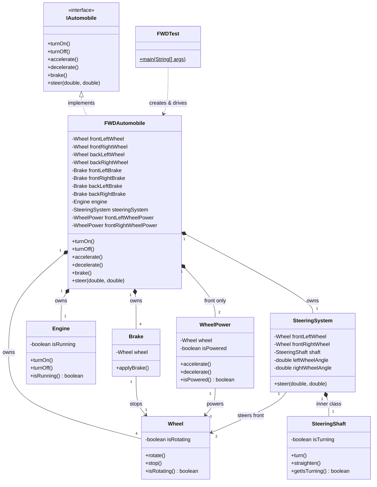
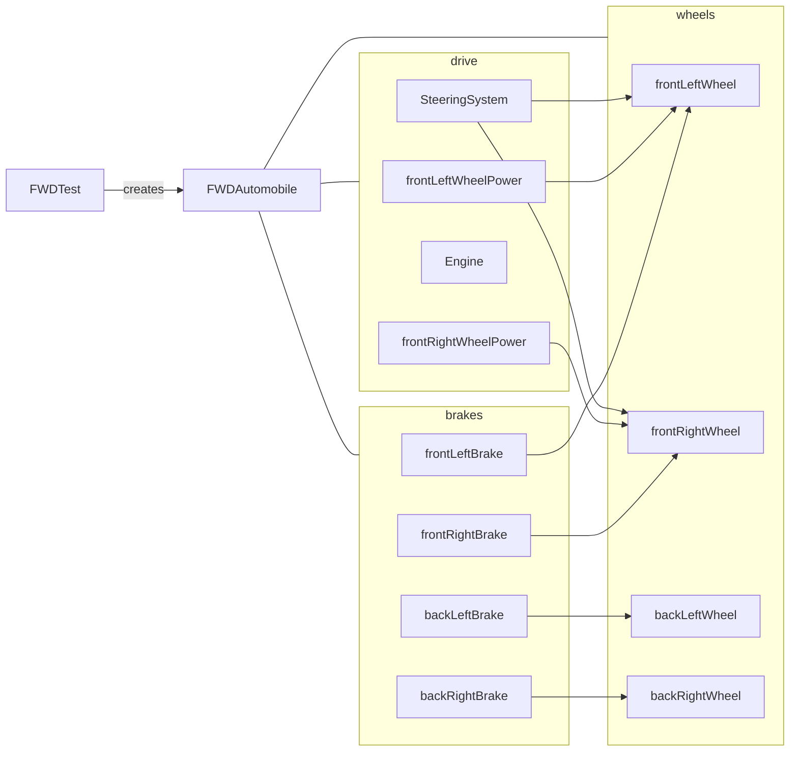

# FWDTest UML Diagrams

## Class diagram

```mermaid
classDiagram
    direction TB

    class FWDTest {
        +main(String[] args)$
    }

    class IAutomobile {
        <<interface>>
        +turnOn()
        +turnOff()
        +accelerate()
        +decelerate()
        +brake()
        +steer(double, double)
    }

    class FWDAutomobile {
        -Wheel frontLeftWheel
        -Wheel frontRightWheel
        -Wheel backLeftWheel
        -Wheel backRightWheel
        -Brake frontLeftBrake
        -Brake frontRightBrake
        -Brake backLeftBrake
        -Brake backRightBrake
        -Engine engine
        -SteeringSystem steeringSystem
        -WheelPower frontLeftWheelPower
        -WheelPower frontRightWheelPower
        +turnOn()
        +turnOff()
        +accelerate()
        +decelerate()
        +brake()
        +steer(double, double)
    }

    class Wheel {
        -boolean isRotating
        +rotate()
        +stop()
        +isRotating() boolean
    }

    class Brake {
        -Wheel wheel
        +applyBrake()
    }

    class Engine {
        -boolean isRunning
        +turnOn()
        +turnOff()
        +isRunning() boolean
    }

    class WheelPower {
        -Wheel wheel
        -boolean isPowered
        +accelerate()
        +decelerate()
        +isPowered() boolean
    }

    class SteeringSystem {
        -Wheel frontLeftWheel
        -Wheel frontRightWheel
        -SteeringShaft shaft
        -double leftWheelAngle
        -double rightWheelAngle
        +steer(double, double)
    }

    class SteeringShaft {
        -boolean isTurning
        +turn()
        +straighten()
        +getIsTurning() boolean
    }

    IAutomobile <|.. FWDAutomobile : implements
    FWDTest ..> FWDAutomobile : creates & drives

    FWDAutomobile "1" *-- "4" Wheel : owns
    FWDAutomobile "1" *-- "4" Brake : owns
    FWDAutomobile "1" *-- "1" Engine : owns
    FWDAutomobile "1" *-- "1" SteeringSystem : owns
    FWDAutomobile "1" *-- "2" WheelPower : front only

    Brake "1" --> "1" Wheel : stops
    WheelPower "1" --> "1" Wheel : powers
    SteeringSystem "1" --> "2" Wheel : steers front
    SteeringSystem "1" *-- "1" SteeringShaft : inner class
```

## Object graph from FWDTest

```mermaid
flowchart LR
    FWDTest -->|creates| fwdCar[FWDAutomobile]

    subgraph wheels
        FLW[frontLeftWheel]
        FRW[frontRightWheel]
        BLW[backLeftWheel]
        BRW[backRightWheel]
    end

    subgraph brakes
        FLB[frontLeftBrake] --> FLW
        FRB[frontRightBrake] --> FRW
        BLB[backLeftBrake] --> BLW
        BRB[backRightBrake] --> BRW
    end

    subgraph drive
        FLWP[frontLeftWheelPower] --> FLW
        FRWP[frontRightWheelPower] --> FRW
        Engine
        Steer[SteeringSystem] --> FLW
        Steer --> FRW
    end

    fwdCar --- wheels
    fwdCar --- brakes
    fwdCar --- drive
```
